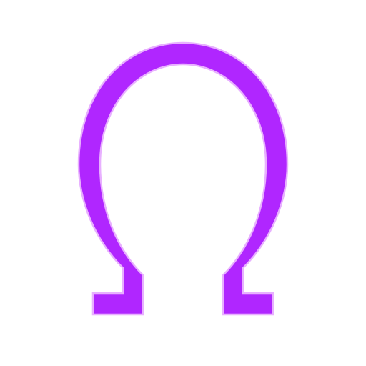

markdown
<div align="center">

  

  # ΩFFΣLLIα - GENESIS
  ### `llama.cpp_offellia`

  <p>
    <em>Structural Tensor Optimization via Helicoidal-Zeta Kernel & Dynamic Coprime Probing</em>
  </p>

  

  <a href="https://zenodo.org/records/21436487">
    
  </a>
  <a href="https://github.com/brunobecker/llama.cpp_offellia">
    
  </a>
  <a href="https://huggingface.co/brunobecker">
    
  </a>
  <a href="https://twitter.com/Brunoxuser">
    
  </a>
  <a href="https://www.python.org/">
    
  </a>
  <a href="https://github.com/ggerganov/llama.cpp">
    
  </a>

</div>

---

## 🌌 Abstract

**`llama.cpp_offellia`** is an advanced, mathematically-driven fork of `llama.cpp` and the `gguf-py` quantization pipeline. It introduces the **OFFELLIA-GENESIS Framework**, which replaces standard heuristic memory access patterns and linear tensor scaling with rigorous number-theory and complex-analysis models.

By leveraging the **Helicoidal-Zeta Kernel** (evaluating the Riemann Zeta function on the critical line) and **Dynamic Coprime Probing** (based on the golden ratio $\phi$ and prime topology), OFFELLIA minimizes cache resonance, eliminates primary clustering in massive tensor graphs, and applies non-linear topological embeddings during the quantization and dequantization phases.

> **Framework:** OFFELLIA-GENESIS (Helicoidal-Zeta Kernel)
> **Author:** Bruno Becker (ΩFFΣLLIα) | 2025-2026
> **Archive:** [Zenodo DOI: 10.5281/zenodo.20026837](https://doi.org/10.5281/zenodo.20026837)

---

## 🧬 Core Architecture & Theory

The OFFELLIA architecture operates on two distinct layers, bridging low-level C memory management with high-level Python tensor transformations.

### 1. C/C++ Layer: Dynamic Coprime Hash Probing (`ggml-impl.h`)
Standard GGML uses power-of-2 hash tables with linear probing, which suffers from primary clustering in massive computation graphs. OFFELLIA introduces **Dynamic Coprime Probing**:
*   **Theory:** Any odd number is coprime with a power of 2.
*   **Implementation:** We use a base step of `13` (derived from the OFFELLIA $\varphi(42)=12$ structure). This guarantees a full, collision-free traversal of all hash slots without clustering, drastically reducing cache misses during graph evaluation. If the table size is not a power of 2, a dynamic GCD fallback ensures safety.

```c
// OFFELLIA: Coprime step derived from φ(42) structure
static inline size_t ggml_hash_coprime_step(size_t table_size) {
    size_t step = 13; // Base prime from OFFELLIA φ(42) structure
    // Fallback de segurança: se table_size não for potência de 2, encontra um coprimo dinâmico
    if ((table_size & (table_size - 1)) != 0) {
        size_t a = table_size, b = step;
        while (b != 0) { size_t t = b; b = a % b; a = t; } // GCD
        while (a != 1 && step < table_size) {
            step += 2;
            a = table_size; b = step;
            while (b != 0) { size_t t = b; b = a % b; a = t; }
        }
        if (step >= table_size) step = 1;
    }
    return step;
}
```

### 2. Python Layer: Helicoidal-Zeta Kernel (`quants.py`)
During the GGUF quantization and dequantization pipeline, tensor blocks are not merely scaled by min/max values. They are passed through the `HelicoidalZetaCore`, applying a topological signature:
*   **Golden Ratio Helicoid:** $F(n) = \sin^2(2\pi\phi n)$
*   **Riemann Zeta Signature:** Evaluated at $s = 0.5 + in$, mapping the block index $n$ into a complex plane embedding.
*   **Reversibility:** The framework implements a strict `inverse_transform` during dequantization to perfectly recover the original tensor scale.

```python
# OFFELLIA: Intercepts block quantization/dequantization
zeta_core = HelicoidalZetaCore(zeta_dps=21, use_primes=False)

# Quantization Phase
blocks[i] = zeta_core.transform(blocks[i], n_val=i+1)

# Dequantization Phase (Essential for recovery)
dequant_blocks[i] = zeta_core.inverse_transform(dequant_blocks[i], n_val=i+1)
```

---

## 📐 Mathematical Formulation

The scaling factor applied to tensor blocks is derived from the mean of a multi-dimensional mathematical embedding:

$$
\text{Emb}(n) = \left[ \vec{C}(n) \cdot \delta(n), \ R(n), \ \Theta(n), \ \Re(\zeta(s)), \ \Im(\zeta(s)) \right]
$$

Where:
*   $\vec{C}(n)$ are the 3D helicoidal coordinates.
*   $\delta(n)$ is the coprime modulus delta ($\varphi(42)$).
*   $\zeta(s)$ is the Riemann Zeta function evaluated at the critical line $s = 0.5 + in$.
*   The final scale is bounded by $\tanh(\text{mean}(\text{Emb}(n)))$.

---

## 🚀 Installation & Usage

### Prerequisites
*   `mpmath` (Required for high-precision Zeta function evaluation)
*   `numpy`
*   Standard `llama.cpp` build tools (CMake, GCC/Clang)

### Python Quantization Pipeline (GGUF)
To use the OFFELLIA quantization transforms when converting models to GGUF:

```bash
pip install mpmath numpy
```

```python
from gguf.quants import HelicoidalZetaCore
import numpy as np

# Initialize the OFFELLIA Kernel
core = HelicoidalZetaCore(zeta_dps=21, use_primes=False)

# The transform is automatically applied during custom GGUF quantization
# if the OFFELLIA hooks are enabled in the conversion script.
# Audit logs will print: "[AUDITORIA] OFFELLIA ATIVA - Bloco X..."
```

### C++ Inference Engine
Compile the modified `llama.cpp` with the OFFELLIA hash optimizations included natively in `ggml-impl.h`:

```bash
cmake -B build
cmake --build build --config Release
```

---

## 🎨 Visual Identity & Cyberpunk Aesthetics

The OFFELLIA project embraces a **Cyberpunk / Neon** visual identity, reflecting the intersection of ancient mathematics and futuristic AI infrastructure. The UI and design system (defined in `app.css`) utilize a strict `oklch` neon palette:

*   **Primary Neon:** Cyan (`#00FFFF` / `oklch(0.75 0.28 195)`) - Representing the flow of data and logic.
*   **Secondary Neon:** Magenta (`#FF00FF` / `oklch(0.7 0.28 330)`) - Representing the complex plane and Zeta zeros.
*   **Accent:** Electric Purple (`#9D00FF` / `oklch(0.65 0.28 290)`) - Representing the Golden Ratio $\phi$ and helicoidal geometry.
*   **Symbol:** Ω (Omega) - The ultimate limit, the end of standard heuristics, the beginning of structural truth.

*(See `app.css` for the complete design system, neon glow filters, and `logo.svg` for the vector identity).*

---

## 📚 Citation

If you use **`llama.cpp_offellia`** or the **Helicoidal-Zeta Kernel** in your research, please cite the Zenodo archive:

```bibtex
@software{becker2026offellia,
  author       = {Bruno Becker},
  title        = {OFFELLIA-GENESIS: Helicoidal-Zeta Kernel and Coprime Probing for Tensor Graphs},
  month        = {jan},
  year         = {2026},
  publisher    = {Zenodo},
  doi          = {10.5281/zenodo.20026837},
  url          = {https://doi.org/10.5281/zenodo.20026837}
}
```

---

## 📬 Contact & Community

*   **Author:** Bruno Becker (ΩFFΣLLIα)
*   **X (Twitter):** [@Brunoxuser](https://twitter.com/Brunoxuser)

*   **Tag:** `#OFFELLIA`

---

## ⚖️ License & Acknowledgements

*   **Base Engine:** [llama.cpp](https://github.com/ggerganov/llama.cpp) by Georgi Gerganov and contributors (MIT License).
*   **OFFELLIA Modifications:** Copyright © 2025-2026 Bruno Becker.
*   *The mathematical implementations (Helicoidal-Zeta, Coprime Hash) are provided as-is for research and experimental inference optimization.*

<br/>

<div align="center">
  <sub>
    "The structure of graphs is optimized based on the geometry of prime numbers and the helicoidal function." <br/>
    <strong>ΩFFΣLLIα 2026</strong>
  </sub>
</div>
